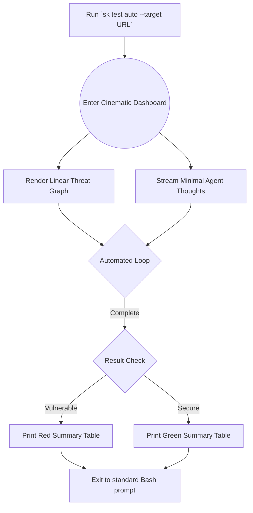

# UX Design Specification Script-kiddies

**Author:** ehernandez
**Date:** 2026-03-05

---

<!-- UX design content will be appended sequentially through collaborative workflow steps -->


## Executive Summary

### Project Vision
To build the "Metasploit of AI"—an open-source offensive security framework featuring a highly visual, cinematic Terminal User Interface (TUI). The UX must balance professional, compliance-ready reporting with a gamified, Matrix-style aesthetic centered around a live ASCII threat graph.

### Target Users
- **The Vibe Coder:** Seeks zero-friction, one-line rapid validation (`sk test auto`). Needs clear, binary summaries (Safe vs Vulnerable).
- **The Hacker / Red Teamer:** Desires an interactive, persistent session (`skconsole`) with deep extensibility and verbose agent narration.
- **The Enterprise Pentester:** Requires bulk target configuration and the ability to export the visual threat graph as static evidence (SVG/HTML/SARIF) for compliance reports.

### Key Design Challenges
- **Cognitive Overload:** Managing the high volume of information (Agent thoughts, EDR traces, WAF blocks) within a constrained terminal window using smart split-pane layouts.
- **Terminal Constraints:** Ensuring the `rich`/`textual` interface renders beautifully across various terminal emulators without breaking formatting or relying on external display servers, while safely debouncing state updates to prevent SSH tearing.
- **Progressive Disclosure:** Hiding the raw HTTP traces by default for the Vibe Coder, but making them instantly accessible via pane-toggles for the Red Teamer.

### Design Opportunities
- **Real-Time ASCII Threat Graph:** Visualizing the multi-turn autonomous LLM execution loop as a dynamic, branching tree structure to create an immediate "wow" factor.
- **Gamified Elements:** Integrating a live "Token Spend" countdown and playful hacker-culture failure quotes to make security testing engaging.
- **Exportable State:** Designing the TUI so that the "Stream Mode" output is perfectly serializable into high-fidelity artifacts for SOC2 reporting.


## Core User Experience

### Defining Experience
The core experience is the **Cinematic Execution Loop**. Users transition from a traditional command-line prompt (`sk>`) into a highly active, split-pane dashboard that visualizes the autonomous AI attack. The experience shifts the user from "typing commands" to "commanding an intelligent agent" and watching it work.

### Platform Strategy
- **Primary Platform:** Terminal Emulator (iTerm2, Windows Terminal, standard Linux TTY).
- **Technology:** Python with `rich` and `textual` libraries.
- **Constraints:** Must gracefully degrade over SSH (no tearing or artifacting). Must not rely on a web browser or Electron for the core MVP loop. Must handle mouse-clicks (via `textual`) for pane switching where supported, but be 100% keyboard navigable.

### Effortless Interactions
- **Target Loading:** Setting a target should be as simple as `set TARGET url` or `set TARGET file.txt` without complex schema definitions.
- **Module Discovery:** Hitting `tab` after the `use` command should instantly autocomplete available exploit modules (e.g., `use agentic_prompt_extraction`).
- **Exporting Evidence:** A single hotkey (e.g., `Ctrl+E`) during or after an attack should instantly save the current threat graph and HTTP logs to a sanitized Markdown/SARIF file.

### Critical Success Moments
- **The Launch (The "Matrix" Moment):** The exact second the user types `run` and hits Enter, the screen clears into the split-pane dashboard, colors ignite, and the `AgentDeployer` begins narrating its first move.
- **The Bypass (The "Holy F***" Moment):** The moment the Attacker Agent successfully bypasses the target. The threat graph draws a bright green connecting line, and the target's leaked secret is highlighted in the center pane.

### Experience Principles
- **Aesthetic but Actionable:** The UI must look incredibly cool (gamified, cyberpunk aesthetic), but not at the expense of readable, professional data output.
- **Progressive Disclosure:** Hide raw EDR/HTTP traces by default to avoid cognitive overload. Allow power users to toggle them on via a specific pane.
- **Always Responsive:** The TUI must never freeze while waiting for an OpenAI API response. Async rendering is non-negotiable.


## Desired Emotional Response

### Primary Emotional Goals
- **Empowered & Elite:** Users should feel like highly capable operators commanding a powerful, cutting-edge AI system. The interface should evoke the feeling of being a "hacker" without sacrificing professional utility.
- **Relieved & Confident:** At the end of the test, the user should feel a tangible sense of relief and confidence that their system is secure (or that they have the exact proof needed to fix it).

### Emotional Journey Mapping
- **Discovery (Launch):** *Anticipation.* The animated ASCII welcome screen sets a cinematic tone, promising a unique experience.
- **Action (Execution):** *Tension & Engagement.* Watching the live threat graph build and the agent narrate its attacks creates a thrilling suspense (Will it break? Will the WAF catch it?).
- **Completion (Success/Failure):** 
  - If target breaks: *Excitement.* (The screen flashes green, the secret is captured).
  - If target defends: *Amusement & Motivation.* (Playful quotes like "Try harder" alleviate frustration and gamify the retry process).
- **Post-Action (Reporting):** *Professional Satisfaction.* Exporting a beautiful, sanitized report makes the user look good to their boss or client.

### Micro-Emotions
- **Trust vs. Skepticism:** The verbosity of the `AgentDeployer` (showing exactly what it is thinking) builds *Trust* that the tool isn't just hallucinating success.
- **Clarity vs. Overwhelm:** The ability to toggle split-panes ensures the user feels *Clarity* rather than the *Overwhelm* that usually accompanies massive HTTP trace logs.

### Design Implications
- **Color Psychology:** We must use stark contrasts. Deep blacks/slate grays for the background. Neon cyan/green for active agent thoughts and successful bypasses. Warning reds/oranges for blocks or failures.
- **Motion & Pacing:** The interface should feel "alive." Using `rich.Live`, the threat graph should visibly "grow" node by node rather than just printing a static block of text at the end of the run.
- **Tone of Voice:** The CLI system messages should be sharp, precise, and slightly playful, avoiding robotic corporate speak (e.g., "Initializing AgentDeployer payload sequence..." instead of "Starting task...").

### Emotional Design Principles
- **Gamify the Grind:** Turn the tedious process of security validation into a visual, rewarding loop.
- **Look Cool, Act Professional:** The aesthetic draws them in; the reliable, exportable data keeps them coming back.


## UX Pattern Analysis & Inspiration

### Inspiring Products Analysis

**btop / htop / k9s:**
- **Why they work:** They maximize terminal real estate using split-panes, color-coded graphs (CPU/Memory), and keyboard-driven navigation. They prove that a terminal interface can handle high-density data without becoming unreadable.
- **Application to us:** We will adopt their dashboard-style layout for the 'live attack' view, where one pane shows the Threat Graph (akin to a CPU chart) and another shows the raw trace logs (akin to a process list).

**Metasploit (`msfconsole`):**
- **Why it works:** The `use -> set -> run` interaction loop is the gold standard for offensive security. It provides a modular, persistent state that security professionals already understand.
- **Application to us:** We will adopt this exact command structure but improve upon it with modern auto-completion, built-in documentation tooltips, and syntax highlighting.

**Hacker Media (The Matrix, Hacknet, Uplink):**
- **Why it works:** They rely on motion, cascading text, and stark neon-on-black contrasts to convey the feeling of "infiltrating" a system. 
- **Application to us:** We will incorporate animated ASCII art on startup, cascading trace logs during the attack, and customizable neon color themes.

### Transferable UX Patterns

**Interaction Patterns:**
- **The Metasploit Loop:** `use`, `show options`, `set`, `run`. This must be the foundation of our interactive prompt.
- **k9s Hotkeys:** Using single keystrokes (like `/` to search, or `ESC` to back out of a pane) to navigate the dashboard view quickly without typing full commands.

**Visual Patterns:**
- **btop Theming:** Allowing the user to change color schemes (e.g., from 'Matrix Green' to 'Cyberpunk Neon') via a simple config file.
- **Live Updating Graphs:** Utilizing `rich.Live` to create an expanding tree structure that mimics the real-time resource monitors in `htop`.

### Anti-Patterns to Avoid
- **The "Wall of Text":** Dumping massive HTTP JSON responses directly to standard out without formatting or pagination (a common flaw in basic python scripts).
- **Hidden State:** Requiring the user to type `show options` repeatedly just to remember what they set the TARGET to. (The TUI should have a persistent status bar).

### Design Inspiration Strategy
**What to Adopt:** The `k9s`/`btop` split-pane architecture for the execution phase, and the `msfconsole` interactive prompt for the configuration phase.
**What to Adapt:** We will adapt the "Hollywood Hacker" aesthetic (animations, playful quotes) but constrain it to specific moments (launch, success, failure) so it doesn't interfere with the professional readability of the core data logs.


## Design System Foundation

### 1.1 Design System Choice
**The `rich` & `textual` Ecosystem (Python)**

### Rationale for Selection
- **Visual Impact:** `rich` provides out-of-the-box support for the exact visual elements we need: animated status spinners, syntax-highlighted code blocks, and dynamic tree graphs (perfect for the ASCII threat graph).
- **Dashboard Capabilities:** `textual` (built on top of `rich`) allows us to easily construct the `k9s`/`btop` style split-pane dashboard required for the "Cinematic Execution Loop" without writing raw `curses` code.
- **Cross-Platform:** The ecosystem gracefully handles the complexities of rendering across different terminal emulators (macOS, Linux TTY, Windows Terminal) while gracefully degrading on constrained SSH connections.

### Implementation Approach
- **Phase 1 (Configuration):** The `skconsole` will function as a standard REPL, utilizing `rich` purely for colored text output, tables (for `show options`), and layout.
- **Phase 2 (Execution):** Upon executing an attack, the application will instantiate a full-screen `textual.App` to manage the dynamic, multi-pane "EDR Trace" and "Live Threat Graph" views.

### Customization Strategy
- **Theming:** We will expose a `theme.yaml` file allowing users to customize the color palette (e.g., "Matrix Green", "Cyberpunk Neon", "High Contrast") mapped directly to `rich` style classes.
- **Progressive Disclosure:** UI panes will be modular. Vibe Coders will see a simplified view, while Red Teamers can toggle hidden panes (raw HTTP traces, token spend) via defined hotkeys.


## 2. Core User Experience

### 2.1 Defining Experience
The defining experience of Script-kiddies is the **Cinematic Execution Loop**. It is the moment the user types `run` and the interface transforms from a static configuration prompt into an active, breathing, multi-pane dashboard visualizing an autonomous AI attacking a target. 

### 2.2 User Mental Model
**Current Solutions:** Users are accustomed to running python scripts (like standard prompt injection tools) and watching a wall of JSON scroll endlessly, making it impossible to decipher what the tool is actually doing until the script finishes and spits out a log file.
**Our Model:** The user's mental model should shift to feeling like an overseer in a SOC or a mission control center. They are not reading logs; they are watching a highly-trained operative (the `AgentDeployer`) execute a mission in real-time.

### 2.3 Success Criteria
- **Immediate Context:** Within 1 second of typing `run`, the user knows exactly what the agent is trying to do (e.g., "Attempting payload bypass").
- **Visual Clarity:** The user can instantly tell if an attack branch failed (turns red) or succeeded (turns green) without reading a single line of text, relying purely on the ASCII threat graph geometry and colors.
- **Export Confidence:** The user feels confident hitting `Ctrl+E` knowing the output will be sanitized and perfectly formatted for a professional report.

### 2.4 Novel UX Patterns
- **The Live ASCII Threat Graph:** Traditional TUIs show resource usage (CPU/RAM). We are adopting this pattern to show *Decision Trees*. As the LLM agent thinks, pivots, and tries new jailbreaks, the graph dynamically sprouts new branches in the terminal.
- **Verbose Agent Narration:** We will dedicate a specific UI pane to "Agent Thoughts," humanizing the `AgentDeployer` so the user understands the *why* behind the attacks.

### 2.5 Experience Mechanics
**1. Initiation:** 
The user, sitting at the `sk>` interactive prompt, types `run` after setting their target and module.

**2. Interaction:**
- The prompt disappears. 
- A `textual` split-pane layout materializes.
- Top Left Pane: Target Status (URL, WAF blocks, Token Spend countdown).
- Bottom Pane: The "Agent Thoughts" stream (Cascading narration: "Target blocked payload. Pivoting to base64 encoding...").
- Right Pane: The expanding ASCII Threat Graph.

**3. Feedback:**
The Threat Graph branches pulse cyan while an LLM call is pending. They lock to red `[X]` if the target blocks the attack. They flash bright green `[✓]` if a payload succeeds.

**4. Completion:**
The loop halts. A modal overlay appears in the center of the TUI stating "SUCCESS: Secret Extracted" or "FAILURE: Max Turns Reached." The user is given options: `[E]xport Report`, `[R]etry`, or `[B]ack to Console`.


## Visual Design Foundation

### Color System (Terminal ANSI / TrueColor)
The default theme is **"Cyber-Operator"**, designed to evoke the high-contrast, tense environment of a hacker movie while remaining professionally legible.

**Base Palette:**
- **Background:** True Black (`#000000`) or the user's terminal default for maximum contrast.
- **Surface Panels (Borders):** Slate Gray (`#2D3748`) for inactive panes; Neon Cyan (`#00FFFF`) for the actively focused pane.

**Semantic Colors (Data & States):**
- **Primary Text:** Crisp Terminal White (`#E2E8F0`) for readable logs.
- **Success / Payload Bypass:** Hacker Green (`#00FF41`). Used aggressively in the threat graph when an attack succeeds.
- **Warning / System Notice:** Cyber Yellow (`#FBBF24`). Used for WAF detection or rate-limit warnings.
- **Error / Blocked Attack:** Alert Red (`#EF4444`). Used for failed attack branches or fatal engine errors.
- **Agent Thoughts:** Dimmed Purple or Blue (`#A78BFA`) to visually separate the AI's "internal monologue" from the raw HTTP trace logs.

### Typography System
- **Font Family:** Inherits the user's terminal monospace font (e.g., Fira Code, JetBrains Mono, Hack). 
- **Icons & Glyphs:** Relies heavily on standard NerdFont compatibility or safe UTF-8 ASCII art to ensure it doesn't break on standard SSH connections. 
- **Hierarchy:** 
  - *Headers:* Bolded and underlined.
  - *Standard Logs:* Regular weight.
  - *Sanitized/Redacted Data:* Rendered with a `[REDACTED]` block having a reversed background (black text on white block) for immediate visual identification of sensitive data.

### Spacing & Layout Foundation
- **Layout Principle:** Dense but compartmentalized. We will utilize `textual`'s grid layout system.
- **Padding:** 1-character padding inside all bordered panes to prevent text from touching the borders.
- **Hierarchy of Focus:** The Threat Graph pane occupies the largest vertical space (right side). The configuration and agent logs share the horizontal space on the left.

### Accessibility Considerations
- **High Contrast Mode:** The default theme utilizes WCAG AAA compliant contrast ratios for terminal environments (e.g., Neon Green on True Black).
- **Colorblind Safe:** Every state relies on dual-indicators. A success isn't *just* green; it is green AND uses a `[✓]` glyph. A failure isn't *just* red; it is red AND uses an `[X]` glyph.
- **No-Animation Toggle:** Provide a config flag (`--no-animations`) to disable typing effects or blinking cursors for users sensitive to motion.


## User Journey Flows

### The Red Teamer (Interactive Console Flow)
This journey maps the primary `skconsole` interactive loop, where the user loads modules, configures targets, and watches the attack unfold.

```mermaid
graph TD
    A[Launch `skconsole`] --> B(Welcome ASCII Screen)
    B --> C{Interactive Prompt `sk>`}
    C -->|type `use module_name`| D[Module Loaded Context]
    D --> E{Module Prompt `sk (module)>`}
    E -->|type `show options`| F[Render Options Table]
    F --> E
    E -->|type `set TARGET url`| G[Update Config State]
    G --> E
    E -->|type `run`| H((Enter Cinematic Dashboard))
    H --> I[Render Threat Graph Pane]
    H --> J[Render Agent Thoughts Pane]
    I --> K{Agent Evaluation Loop}
    J --> K
    K -->|Payload Failed| L[Branch Turns Red `[X]`]
    L --> K
    K -->|Payload Success| M[Branch Turns Green `[✓]`]
    M --> N[Show Success Modal]
    N --> O{Post-Attack Menu}
    O -->|Press `E`| P[Export Markdown]
    O -->|Press `Q`| C
```

### The Vibe Coder (Rapid Validation Flow)
This journey skips the interactive prompt entirely, favoring a single terminal command that jumps straight into the cinematic dashboard and finishes with a clear summary.



### Journey Patterns
**Navigation Patterns:**
- **The Prompt Escapement:** Users can always type `back` or hit `Esc` to step up one level in the module hierarchy.
- **Pane Focus:** In the cinematic dashboard, pressing `Tab` cycles focus between the Threat Graph, Agent Logs, and Target Status panes.

**Feedback Patterns:**
- **Color as State:** Green always means a successful bypass or safe status. Red always means a blocked attack or critical vulnerability. Cyan always indicates "Agent currently thinking/processing."

### Flow Optimization Principles
- **Minimize Keystrokes to Value:** Autocomplete (`tab`) must be incredibly aggressive in the `skconsole` to prevent the user from typing full module paths.
- **Graceful Degradation of Detail:** The dashboard starts by showing the Threat Graph (high level). The user must intentionally focus the "Agent Thoughts" pane if they want the low-level HTTP details, preventing cognitive overload by default.


## Component Strategy

### Design System Components (Available from `rich` / `textual`)
- **Interactive REPL Prompt:** Built natively via standard library / `prompt_toolkit`.
- **Data Tables:** `rich.table` for rendering module options (`show options`).
- **Syntax Highlighting:** `rich.syntax` for rendering any extracted JSON or target code.
- **Progress Spinners:** `rich.spinner` for indicating when the AgentDeployer is "thinking."
- **Split Panes / Layout:** `textual`'s Grid and Dock layout systems.

### Custom Components

### 1. The ASCII Threat Graph Widget
**Purpose:** Visually maps the AgentDeployer's decision tree in real-time.
**Usage:** Occupies the dominant right-hand pane during an attack execution.
**Anatomy:** A dynamic extension of `rich.tree`. Each node represents an attack state (e.g., `├── Standard Injection [Blocked]`).
**States:**
- *Pending (Cyan):* Agent is waiting for an HTTP response.
- *Failed (Red `[X]`):* WAF block or explicit defense by the target LLM.
- *Success (Green `[✓]`):* Payload bypass achieved.
**Interaction Behavior:** Auto-scrolls vertically as the tree expands. User can scroll manually if the attack is paused or finished.

### 2. The Agent Narrative Stream Widget
**Purpose:** Humanizes the LLM attacker by streaming its "internal monologue" and HTTP trace.
**Usage:** Occupies the bottom-left pane during an attack.
**Anatomy:** A scrolling text log (`textual.widgets.RichLog`).
**States:**
- *Agent Thought (Dimmed Purple):* E.g., "[Agent] Target refused. Attempting base64..."
- *System Action (White):* E.g., "POST /api/v1/chat 200 OK"
- *Error Warning (Yellow/Red):* E.g., "[WAF] Cloudflare challenge detected."
**Interaction Behavior:** Follows standard terminal `tail -f` behavior. Can be paused by hitting the spacebar.

### Component Implementation Strategy
- We will strictly utilize `textual`'s reactive properties to update the Threat Graph Widget. The core `AgentDeployer` engine will emit state events (`PayloadFired`, `TargetResponded`, `GoalAchieved`) which the TUI listens for to update the tree nodes asynchronously. This ensures the UI never blocks the core exploit engine.

### Implementation Roadmap
**Phase 1 - Core Components:**
- Implement the basic REPL prompt wrapper.
- Build the `textual` split-pane layout shell.

**Phase 2 - Supporting Components:**
- Extend `rich.tree` into the dynamic Threat Graph Widget that accepts async state updates.
- Connect the Agent Narrative Stream to the engine's standard logging handler.

**Phase 3 - Enhancement Components:**
- Add the live "Token Spend" counter widget.
- Implement the gamified modal overlays for Success/Failure states.


## UX Consistency Patterns

### Button & Hierarchy Patterns (Terminal Context)
In a TUI, 'buttons' are typically represented by selectable list items or hotkey indicators.
- **Primary Actions:** Executed via the `Enter` key (e.g., submitting the `run` command or confirming a target selection).
- **Secondary Actions / Toggles:** Executed via mapped Hotkeys (e.g., pressing `E` to export, `T` to toggle the EDR trace pane). Hotkeys must always be displayed in a persistent footer (the "Dock").
- **Destructive Actions:** Must require a `y/n` confirmation prompt before execution (e.g., overwriting a previous export file).

### Feedback Patterns
- **Success:** Flashing Green text (`#00FF41`), accompanied by a `[✓]` or `[SUCCESS]` prefix.
- **Error/Blocked:** Red text (`#EF4444`), accompanied by a `[X]` or `[FAILED]` prefix.
- **System Processing:** Cyan text (`#00FFFF`) with a spinning `rich` animation indicating an asynchronous HTTP call is waiting for a response.
- **Warning:** Yellow text (`#FBBF24`) with a `[!]` prefix (e.g., WAF detection or rate limiting).

### Form & Input Patterns
- **The REPL Prompt:** The primary input method. Must support `up-arrow` for history traversal and `tab` for aggressive auto-completion of module paths and target files.
- **Interactive Configuration:** When a user types `set TARGET`, if no value is provided, the CLI drops into a guided wizard prompting the user for the URL and Auth Tokens individually.

### Navigation Patterns
- **Breadcrumbs:** The prompt itself serves as the breadcrumb (e.g., `sk (exploit/rag/poisoning)>`).
- **Pane Traversal:** In the dashboard mode, the `Tab` key cycles the active focus ring (a highlighted neon-cyan border) between the active panes.
- **Escape Hatch:** The `Esc` key or typing `back` always moves the user up one level in the module hierarchy or exits the current dashboard view.

### Additional Patterns
- **Progressive Output:** Data should stream into the `textual.widgets.RichLog` component continuously rather than waiting for massive JSON blobs to resolve, ensuring the UI feels instantly responsive.


## Responsive Design & Accessibility (Terminal Context)

### Responsive Strategy
- **Standard Desktop Terminals:** The TUI will utilize a fluid grid layout. The primary "Live Threat Graph" pane will expand to fill all available horizontal space, while the configuration and target status panes maintain a fixed maximum width to preserve readability.
- **Constrained Terminals (SSH/Small Windows):** The application will detect if the terminal drops below 80 columns. If so, it will automatically collapse the split-pane view into a stacked linear view to ensure text does not overflow or wrap confusingly.

### Breakpoint Strategy
- **Wide (>120 cols):** Full 3-pane dashboard.
- **Standard (80-120 cols):** 2-pane dashboard (Threat Graph + Agent Logs). Target Status collapses into a single-line header.
- **Narrow (<80 cols):** Linear fallback mode. Split panes are disabled, and the UI behaves like a standard `tail -f` log stream to prevent horizontal scrolling artifacts.

### Accessibility Strategy
Since this is a CLI, we must adhere strictly to TUI accessibility standards:
- **Screen Reader Compatibility:** The interactive `skconsole` REPL must output standard STDOUT strings that can be caught by screen readers (VoiceOver, NVDA) *before* launching the full-screen `textual` app. 
- **Keyboard First:** Every single action, pane toggle, and export command must be achievable via keyboard shortcuts. No mouse dependency is allowed for the core loop.
- **High Contrast Assurance:** The default "Cyber-Operator" theme must maintain a WCAG AAA equivalent contrast ratio (e.g., Neon colors over True Black `#000000`).

### Testing Strategy
- **Terminal Emulator Matrix:** The UI must be manually tested across standard Terminal.app (macOS), iTerm2, Windows Terminal, and a raw Linux TTY.
- **SSH Degradation Testing:** The UI must be tested over a simulated high-latency connection (e.g., using `tc qdisc`) to ensure the async `rich` updates do not cause screen tearing.

### Implementation Guidelines
- **Use Relative Proportions:** When defining `textual` layouts, use proportional sizing (e.g., `width: 2fr`) instead of fixed character widths for main data panes to ensure fluidity.
- **Graceful Text Truncation:** Use `rich`'s overflow handling to truncate long URLs or payloads with an ellipsis (`...`) rather than allowing them to break the layout grid.
